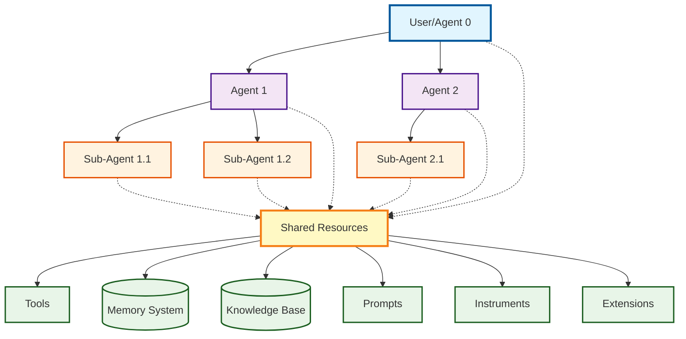
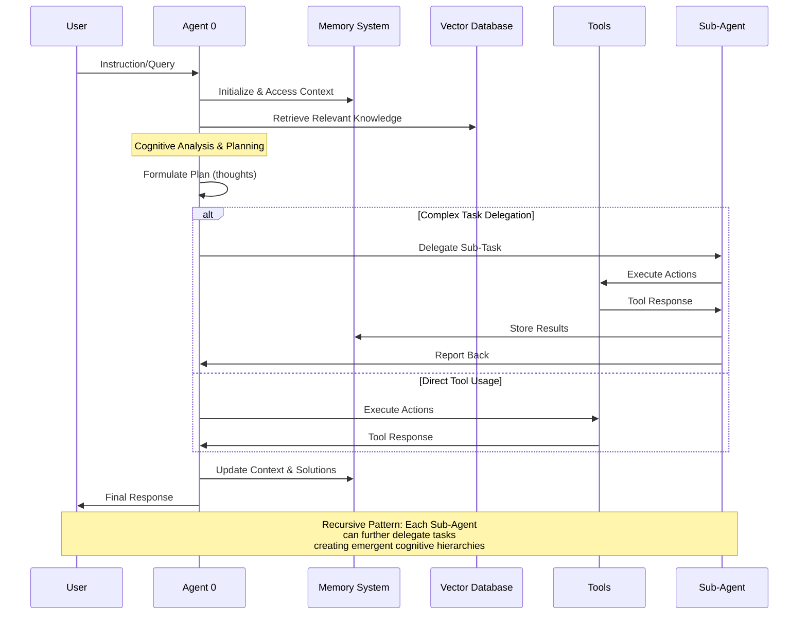
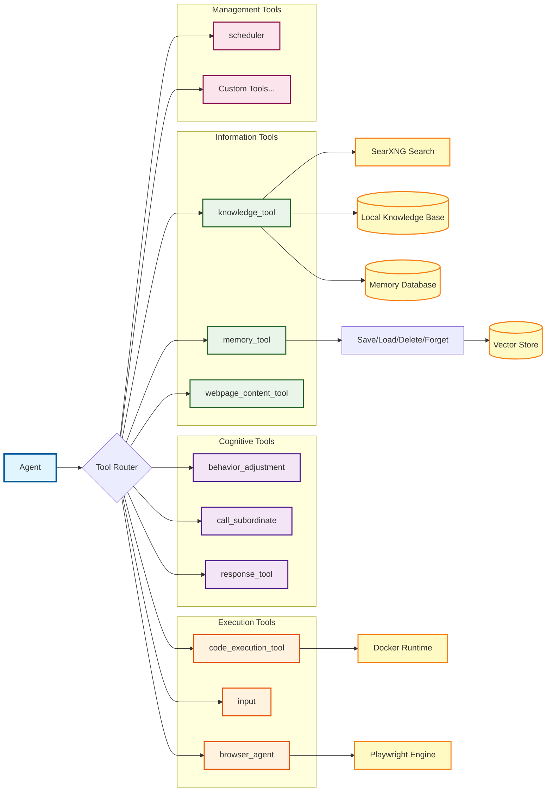
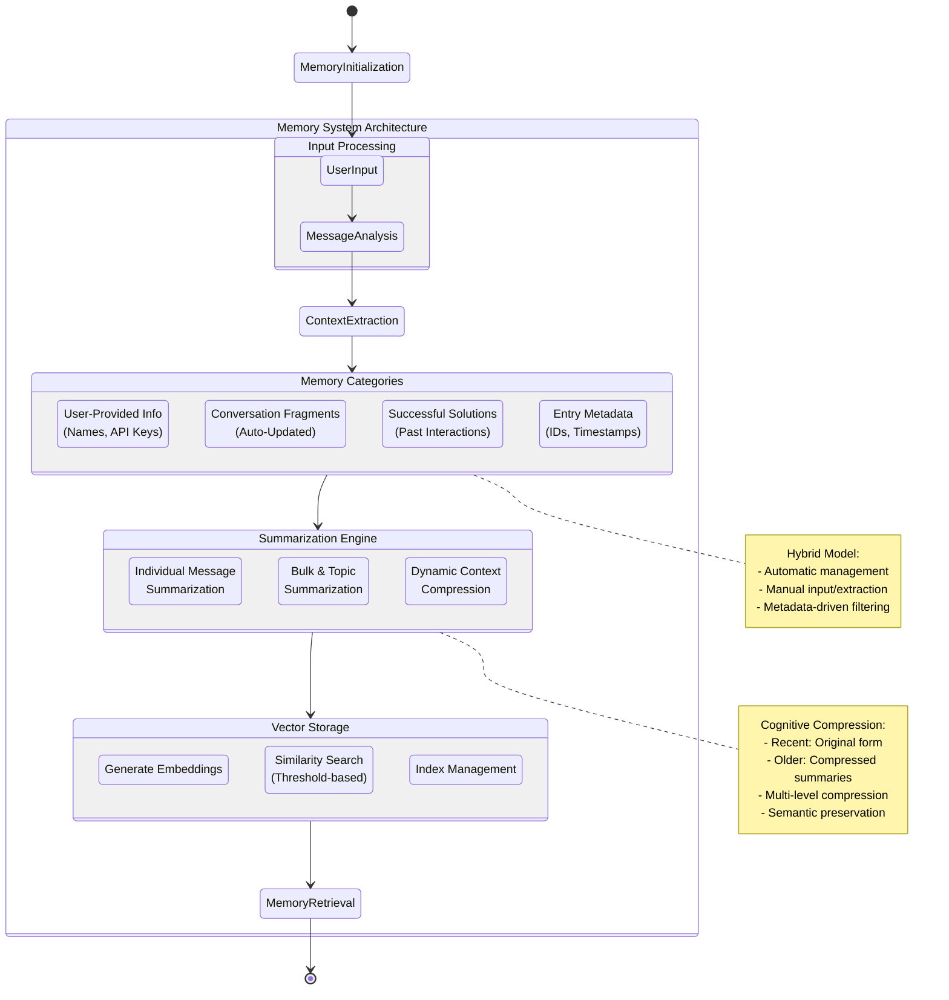
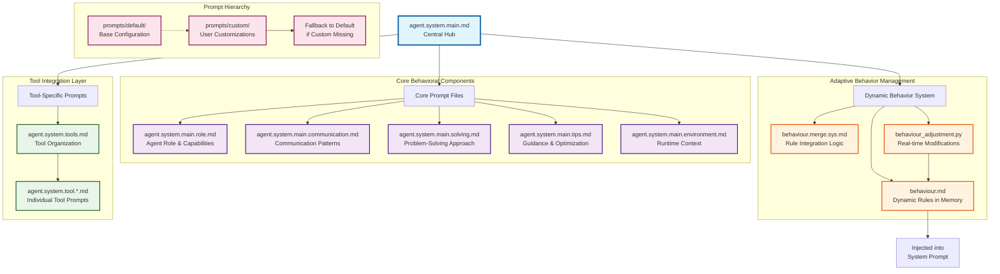
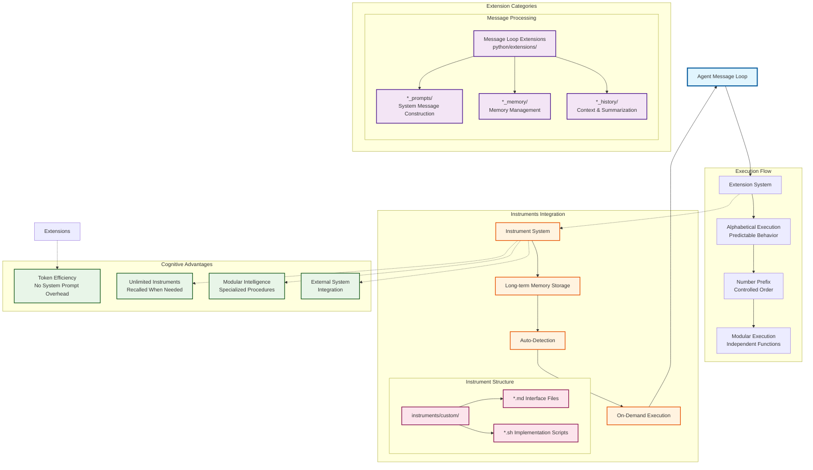
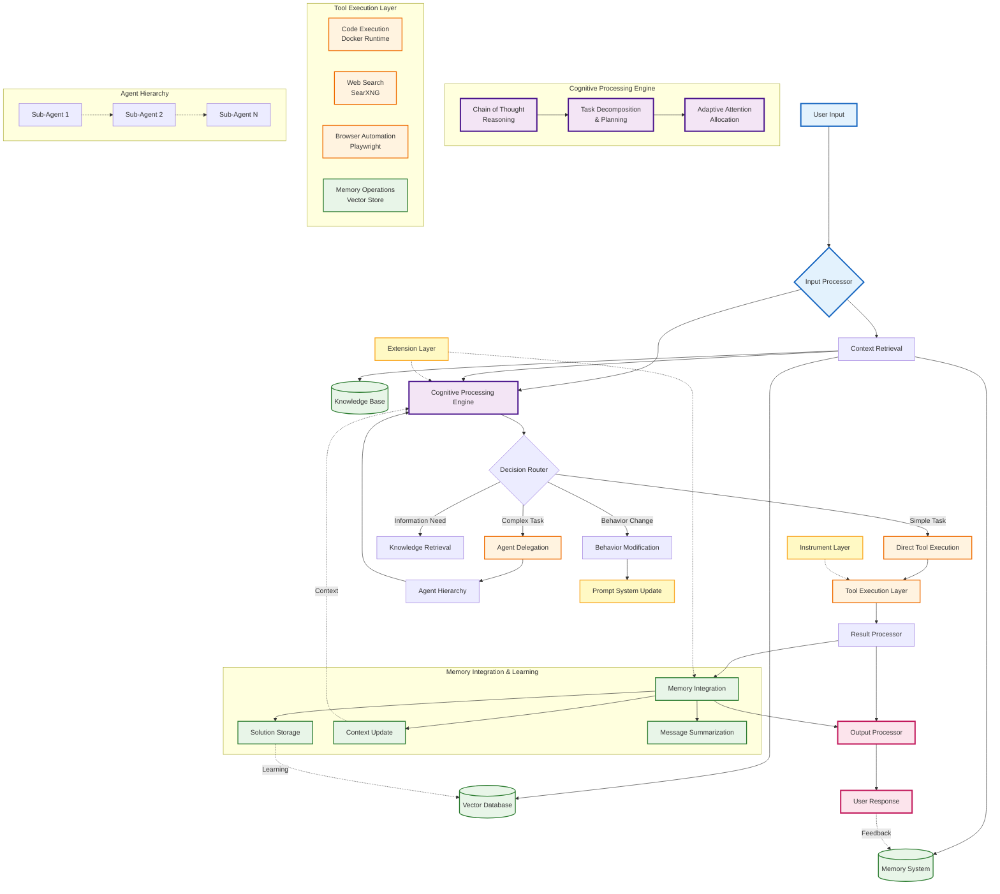

# Architecture Overview
Agent Zero is built on a flexible and modular architecture designed for extensibility and customization. This section outlines the key components and the interactions between them.

## System Architecture
This diagram illustrates the hierarchical relationship between agents and their interaction with tools, extensions, instruments, prompts, memory and knowledge base.

**Architecture Principles:**
- **Hierarchical Delegation:** The user or Agent 0 is at the top of the hierarchy, delegating tasks to subordinate agents, which can further delegate to other agents
- **Shared Resource Access:** Each agent can utilize tools and access the shared assets (prompts, memory, knowledge, extensions and instruments) to perform tasks
- **Cognitive Synergy:** The architecture enables distributed cognition through adaptive attention allocation and neural-symbolic integration points
- **Emergent Patterns:** Complex behaviors emerge from simple agent interactions and tool compositions

## Runtime Architecture
Agent Zero's runtime architecture is built around Docker containers:

1. **Host System (your machine)**:
   - Requires only Docker and a web browser
   - Runs Docker Desktop or Docker Engine
   - Handles container orchestration

2. **Runtime Container**:
   - Houses the complete Agent Zero framework
   - Manages the Web UI and API endpoints
   - Handles all core functionalities including code execution
   - Provides a standardized environment across all platforms

This architecture ensures:
- Consistent environment across platforms
- Simplified deployment and updates
- Enhanced security through containerization
- Reduced dependency requirements on host systems
- Flexible deployment options for advanced users

> [!NOTE]
> The legacy approach of running Agent Zero directly on the host system (using Python, Conda, etc.) 
> is still possible but requires Remote Function Calling (RFC) configuration through the Settings 
> page. See [Full Binaries Installation](installation.md#in-depth-guide-for-full-binaries-installation) 
> for detailed instructions.

## Implementation Details

### Directory Structure
| Directory | Description |
| --- | --- |
| `/docker` | Docker-related files for runtime container |
| `/docs` | Documentation files and guides |
| `/instruments` | Custom scripts and tools for runtime environment |
| `/knowledge` | Knowledge base storage |
| `/logs` | HTML CLI-style chat logs |
| `/memory` | Persistent agent memory storage |
| `/prompts` | System and tool prompts |
| `/python` | Core Python codebase: |
| `/api` | API endpoints and interfaces |
| `/extensions` | Modular extensions |
| `/helpers` | Utility functions |
| `/tools` | Tool implementations |
| `/tmp` | Temporary runtime data |
| `/webui` | Web interface components: |
| `/css` | Stylesheets |
| `/js` | JavaScript modules |
| `/public` | Static assets |
| `/work_dir` | Working directory |

### Key Files
| File | Description |
| --- | --- |
| `.env` | Environment configuration |
| `agent.py` | Core agent implementation |
| `example.env` | Configuration template |
| `initialize.py` | Framework initialization |
| `models.py` | Model providers and configs |
| `preload.py` | Pre-initialization routines |
| `prepare.py` | Environment preparation |
| `requirements.txt` | Python dependencies |
| `run_cli.py` | CLI launcher |
| `run_ui.py` | Web UI launcher |

> [!NOTE]
> When using the Docker runtime container, these directories are mounted 
> within the `/a0` volume for data persistence until the container is restarted or deleted.

## Core Components
Agent Zero's architecture revolves around the following key components:

### 1. Agents
The core actors within the framework. Agents receive instructions, reason, make decisions, and utilize tools to achieve their objectives. Agents operate within a hierarchical structure, with superior agents delegating tasks to subordinate agents.

#### Agent Hierarchy and Communication
Agent Zero employs a hierarchical agent structure, where a top-level agent (often the user) can delegate tasks to subordinate agents. This hierarchy allows for the efficient breakdown of complex tasks into smaller, more manageable sub-tasks.

Communication flows between agents through messages, which are structured according to the prompt templates. These messages typically include:

| Argument | Description |
| --- | --- |
| `Thoughts:` | The agent's Chain of Thought and planning process |
| `Tool name:` | The specific tool used by the agent |
| `Responses or queries:` | Results, feedback or queries from tools or other agents |

#### Interaction Flow
A typical interaction flow within Agent Zero follows this cognitive processing pattern:

**Cognitive Flow Characteristics:**
1. **Context Initialization:** Agent 0 initializes VectorDB and accesses memory for relevant context
2. **Adaptive Planning:** Analyzes instructions and formulates plans using chain-of-thought reasoning
3. **Hierarchical Delegation:** Creates sub-agents for complex tasks, enabling distributed problem-solving
4. **Tool Integration:** Agents utilize specialized tools for actions, providing arguments and processing responses
5. **Memory Integration:** Results and feedback are continuously integrated into the memory system
6. **Emergent Intelligence:** Complex behaviors emerge from simple interaction patterns and recursive delegation

### 2. Tools
Tools are functionalities that agents can leverage. These can include anything from web search and code execution to interacting with APIs or controlling external software. Agent Zero provides a mechanism for defining and integrating both built-in and custom tools.

**Tool Architecture Principles:**
- **Neural-Symbolic Integration:** Tools bridge symbolic reasoning (prompts) with neural processing (LLM execution)
- **Adaptive Attention Allocation:** Tool selection adapts based on context and task requirements
- **Recursive Capability:** Tools like `call_subordinate` enable recursive task decomposition
- **Cognitive Synergy:** Multiple tools can be composed to create emergent problem-solving capabilities

#### Built-in Tools
Agent Zero comes with a set of built-in tools designed to help agents perform tasks efficiently:

| Tool | Function |
| --- | --- |
| behavior_adjustment | Agent Zero use this tool to change its behavior according to a prior request from the user.
| call_subordinate | Allows agents to delegate tasks to subordinate agents |
| code_execution_tool | Allows agents to execute Python, Node.js, and Shell code in the terminal |
| input | Allows agents to use the keyboard to interact with an active shell |
| knowledge_tool | Enables agents to retrieve information from memory, knowledge base or online external sources |
| response_tool | Allows agents to output a response |
| memory_tool | Enables agents to save, load, delete and forget information from memory |
| webpage_content_tool | Enables agents to fetch and analyze the text content of webpages |

#### Knowledge Tool
The `knowledge_tool` uses SearXNG to search the web and retrieve information. It can also search the local knowledge base and memory for relevant information. The tool returns a summary of the information, which can be used by the agent to make decisions or answer questions.

#### SearXNG Integration
Agent Zero has integrated SearXNG as its primary search tool, replacing the previous knowledge tools (Perplexity and DuckDuckGo). This integration enhances the agent's ability to retrieve information while ensuring user privacy and customization.

- Privacy-Focused Search
SearXNG is an open-source metasearch engine that allows users to search multiple sources without tracking their queries. This integration ensures that user data remains private and secure while accessing a wide range of information.

- Enhanced Search Capabilities
The integration provides access to various types of content, including images, videos, and news articles, allowing users to gather comprehensive information on any topic.

- Fallback Mechanism
In cases where SearXNG might not return satisfactory results, Agent Zero can be configured to fall back on other sources or methods, ensuring that users always have access to information.

> [!NOTE]
> The Knowledge Tool is designed to work seamlessly with both online searches through 
> SearXNG and local knowledge base queries, providing a comprehensive information 
> retrieval system.

#### Custom Tools
Users can create custom tools to extend Agent Zero's capabilities. Custom tools can be integrated into the framework by defining a tool specification, which includes the tool's prompt to be placed in `/prompts/$FOLDERNAME/agent.system.tool.$TOOLNAME.md`, as detailed below.

1. Create `agent.system.tool.$TOOL_NAME.md` in `prompts/$SUBDIR`
2. Add reference in `agent.system.tools.md`
3. If needed, implement tool class in `python/tools` using `Tool` base class
4. Follow existing patterns for consistency

> [!NOTE]
> Tools are always present in system prompt, so you should keep them to minimum. 
> To save yourself some tokens, use the [Instruments module](#adding-instruments) 
> to call custom scripts or functions.

### 3. Memory System
The memory system is a critical component of Agent Zero, enabling the agent to learn and adapt from past interactions. It operates on a hybrid model where part of the memory is managed automatically by the framework while users can also manually input and extract information.

**Memory System Cognitive Patterns:**
- **Adaptive Forgetting:** Like human cognition, less critical details fade while important information persists
- **Contextual Relevance:** Information prioritization based on current topic and task requirements  
- **Hierarchical Compression:** Multi-level summarization strategy mimics human memory consolidation
- **Emergent Organization:** Semantic connections naturally form between related topics and concepts

#### Memory Structure
The memory is categorized into four distinct areas:
- **Storage and retrieval** of user-provided information (e.g., names, API keys)
- **Fragments**: Contains pieces of information from previous conversations, updated automatically
- **Solutions**: Stores successful solutions from past interactions for future reference
- **Metadata**: Each memory entry includes metadata (IDs, timestamps), enabling efficient filtering and searching based on specific criteria

#### Messages History and Summarization

Agent Zero employs a sophisticated message history and summarization system to maintain context effectively while optimizing memory usage. This system dynamically manages the information flow, ensuring relevant details are readily available while efficiently handling the constraints of context windows.

- **Context Extraction:** The system identifies key information from previous messages that are vital for ongoing discussions. This process mirrors how humans recall important memories, allowing less critical details to fade.
- **Summarization Process:** Using natural language processing through the utility model, Agent Zero condenses the extracted information into concise summaries. By summarizing past interactions, Agent Zero can quickly recall important facts about the whole chat, leading to more appropriate responses.
- **Contextual Relevance:** The summarized context is prioritized based on its relevance to the current topic, ensuring users receive the most pertinent information.

**Implementation Details:**

- **Message Summaries**: Individual messages are summarized using a structured format that captures key information while reducing token usage.
- **Dynamic Compression**: The system employs an intelligent compression strategy:
  - Recent messages remain in their original form for immediate context.
  - Older messages are gradually compressed into more concise summaries.
  - Multiple compression levels allow for efficient context window usage.
  - Original messages are preserved separately from summaries.
- **Context Window Optimization**:
  - Acts as a near-infinite short-term memory for single conversations.
  - Dynamically adjusts compression ratios based on available space and settings.
- **Bulk and Topic Summarization**:
  - Groups related messages into thematic chunks for better organization.
  - Generates concise summaries of multiple messages while preserving key context.
  - Enables efficient navigation of long conversation histories.
  - Maintains semantic connections between related topics.

By dynamically adjusting context windows and summarizing past interactions, Agent Zero enhances both efficiency and user experience. This innovation not only reflects the framework's commitment to being dynamic and user-centric, but also draws inspiration from human cognitive processes, making AI interactions more relatable and effective. Just as humans forget trivial details, Agent Zero intelligently condenses information to enhance communication.

> [!NOTE]
> To maximize the effectiveness of context summarization, users should provide clear and specific instructions during interactions. This helps Agent Zero understand which details are most important to retain.

### 4. Prompts
The `prompts` directory contains various Markdown files that control agent behavior and communication. The most important file is `agent.system.main.md`, which acts as a central hub, referencing other prompt files.

**Prompt System Cognitive Architecture:**
- **Modular Intelligence:** Separates concerns into specialized behavioral components
- **Adaptive Behavior:** Real-time modification capabilities without disrupting core functionality
- **Hierarchical Override:** Custom prompts intelligently override defaults while maintaining fallback safety
- **Neural-Symbolic Bridge:** Converts structured behavioral rules into neural network guidance patterns

#### Core Prompt Files
| Prompt File | Description |
|---|---|
| agent.system.main.role.md | Defines the agent's overall role and capabilities |
| agent.system.main.communication.md | Specifies how the agent should communicate |
| agent.system.main.solving.md | Describes the agent's approach to tasks |
| agent.system.main.tips.md | Provides additional tips or guidance |
| agent.system.main.behaviour.md | Controls dynamic behavior adjustments and rules |
| agent.system.main.environment.md | Defines the runtime environment context |
| agent.system.tools.md | Organizes and calls the individual tool prompt files |
| agent.system.tool.*.md | Individual tool prompt files |

#### Prompt Organization
- **Default Prompts**: Located in `prompts/default/`, serve as the base configuration
- **Custom Prompts**: Can be placed in custom subdirectories (e.g., `prompts/my-custom/`)
- **Behavior Files**: Stored in memory as `behaviour.md`, containing dynamic rules
- **Tool Prompts**: Organized in tool-specific files for modularity

#### Custom Prompts
1. Create directory in `prompts/` (e.g., `my-custom-prompts`)
2. Copy and modify needed files from `prompts/default/`
3. Agent Zero will merge your custom files with the default ones
4. Select your custom prompts in the Settings page (Agent Config section)

#### Dynamic Behavior System
- **Behavior Adjustment**: 
  - Agents can modify their behavior in real-time based on user instructions
  - Behavior changes are automatically integrated into the system prompt
  - Behavioral rules are merged intelligently, avoiding duplicates and conflicts

- **Behavior Management Components**:
  - `behaviour_adjustment.py`: Core tool for updating agent behavior
  - `_20_behaviour_prompt.py`: Extension that injects behavior rules into system prompt
  - Custom rules stored in the agent's memory directory as `behaviour.md`

- **Behavior Update Process**:
  1. User requests behavior changes (e.g., "respond in UK English")
  2. System identifies behavioral instructions in conversation
  3. New rules are merged with existing ruleset
  4. Updated behavior is immediately applied

- **Integration with System Prompt**:
  - Behavior rules are injected at the start of the system prompt
  - Rules are formatted in a structured markdown format
  - Changes are applied without disrupting other components
  - Maintains separation between core functionality and behavioral rules

> [!NOTE]  
> You can customize any of these files. Agent Zero will use the files in your custom `prompts_subdir` 
> if they exist, otherwise, it will fall back to the files in `prompts/default`.

> [!TIP]
> The behavior system allows for dynamic adjustments without modifying the base prompt files.
> Changes made through behavior rules persist across sessions while maintaining the core functionality.

### 5. Knowledge
Knowledge refers to the user-provided information and data that agents can leverage:

- **Custom Knowledge**: Add files to `/knowledge/custom/main` directory manually or through the "Import Knowledge" button in the UI
  - Supported formats: `.txt`, `.pdf`, `.csv`, `.html`, `.json`, `.md`
  - Automatically imported and indexed
  - Expandable format support

- **Knowledge Base**: 
  - Can include PDFs, databases, books, documentation
  - `/docs` folder automatically added
  - Used for answering questions and decision-making
  - Supports RAG-augmented tasks

### 6. Instruments
Instruments provide a way to add custom functionalities to Agent Zero without adding to the token count of the system prompt:
- Stored in long-term memory of Agent Zero
- Unlimited number of instruments available
- Recalled when needed by the agent
- Can modify agent behavior by introducing new procedures
- Function calls or scripts to integrate with other systems
- Scripts are run inside the Docker Container

#### Adding Instruments
1. Create folder in `instruments/custom` (no spaces in name)
2. Add `.md` description file for the interface
3. Add `.sh` script (or other executable) for implementation
4. The agent will automatically detect and use the instrument

### 7. Extensions
Extensions are a powerful feature of Agent Zero, designed to keep the main codebase clean and organized while allowing for greater flexibility and modularity.

**Extension & Instrument Cognitive Patterns:**
- **Emergent Modularity:** Clean separation enables complex behaviors to emerge from simple, composable components
- **Adaptive Recall:** Instruments stored in long-term memory are recalled based on contextual relevance
- **Token-Efficient Intelligence:** Unlimited capabilities without context window constraints
- **Recursive Enhancement:** Extensions can modify how other extensions operate, creating meta-cognitive loops

#### Structure
Extensions can be found in `python/extensions` directory:
- **Folder Organization**: Extensions are stored in designated subfolders corresponding to different aspects of the agent's message loop
- **Execution Order**: Files are executed in alphabetical order for predictable behavior
- **Naming Convention**: Files start with numbers to control execution order
- **Modularity**: Each extension focuses on a specific functionality

#### Types
- **Message Loop Prompts**: Handle system messages and history construction
- **Memory Management**: Handle recall and solution memorization
- **System Integration**: Manage interaction with external systems

#### Adding Extensions
1. Create Python file in appropriate `python/extensions` subfolder
2. Follow naming convention for execution order (start with number)
3. Implement functionality following existing patterns
4. Ensure compatibility with main system
5. Test thoroughly before deployment

> [!NOTE]  
> Consider contributing valuable custom components to the main repository.
> See [Contributing](contribution.md) for more information.

## Comprehensive Data Flow and Cognitive Pathways

This diagram illustrates the complete data flow and cognitive processing pathways within Agent Zero, showing how information propagates through the system and how emergent intelligence patterns form:

**Emergent Cognitive Properties:**

1. **Recursive Intelligence Amplification:** The system exhibits recursive self-improvement through agent delegation and memory integration, creating emergent problem-solving capabilities beyond the sum of individual components.

2. **Adaptive Attention Mechanisms:** Context-driven resource allocation dynamically adjusts processing focus based on task complexity and available information, mimicking human cognitive attention patterns.

3. **Neural-Symbolic Integration:** The architecture bridges neural language model processing with symbolic reasoning structures (prompts, memory, tools), enabling hybrid AI capabilities.

4. **Hypergraph Pattern Encoding:** Inter-component relationships form complex patterns that enable sophisticated information flow and decision-making pathways.

5. **Distributed Cognitive Synergy:** Multiple agents, tools, and memory systems work in concert to create distributed intelligence that adapts and evolves with each interaction.

This architectural design facilitates the transmutation of implicit cognitive patterns into explicit, actionable intelligence, supporting distributed cognition for all system participants through adaptive, hypergraph-centric information processing.